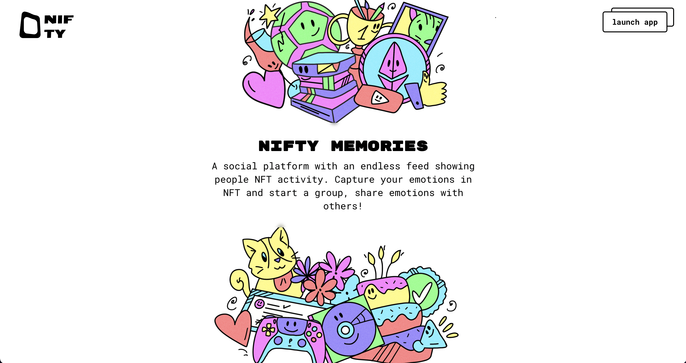

# Nifty Memories UI


[](https://www.gnu.org/licenses/gpl-3.0)

> Interface for Nifty Memories

<p align="center">
  
</p>

<a href="https://github.com/Tointer/nifty-contracts" target="_blank">Smart contracts repo </a>

- Web3 check-in NFT social app
- Create and share memories on Polygon
- Share links to sign memories (NFTs)
- Your own collection of memories, feel free to list on OpenSea

# Set up

```shell
mv .env.example .env
yarn
yarn start
```

<p align="center">
  
</p>
